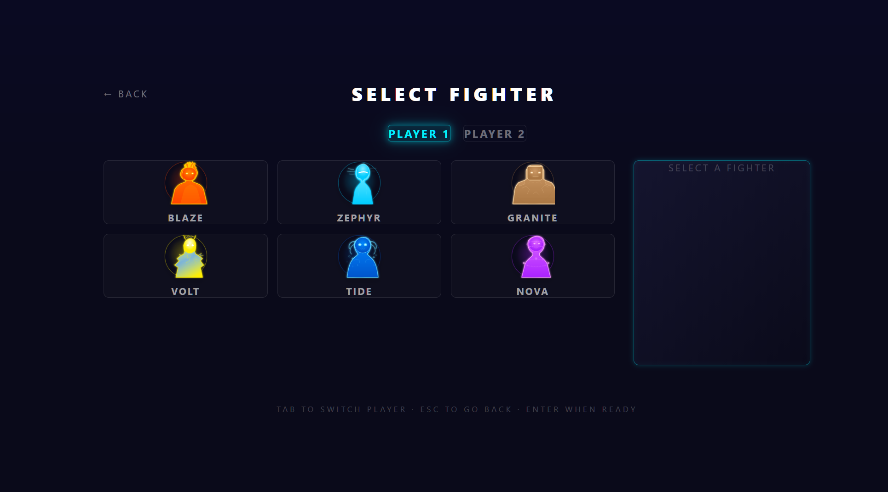
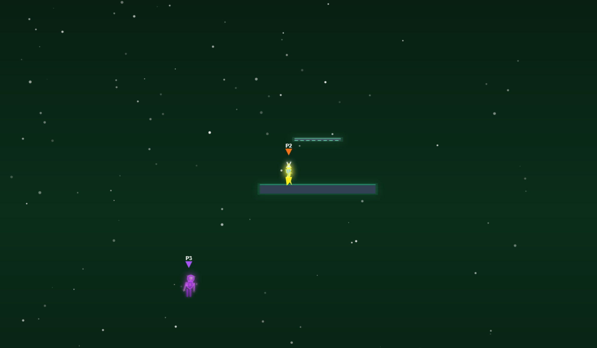

# Temu Smash Bros

Temu Smash Bros is a browser-based platform fighter built with Next.js, React, and HTML5 Canvas. Original characters, procedural audio, neon geometric art style — entirely AI-generated.




## Features

- **6 Original Fighters** — Blaze, Zephyr, Granite, Volt, Tide, Nova. Each with unique movesets, stats, and SVG-rendered visuals.
- **Platform Fighter Combat** — Percentage-based damage, knockback physics, stocks, air combat, shields, dodges, grabs, edge mechanics, DI, teching.
- **4 Stages** — Cosmic Arena, Void Platform, Nebula Ring, Neon District. Parallax backgrounds, neon glow platforms.
- **AI Opponents** — 9 difficulty levels with behavior trees.
- **Procedural Audio** — All SFX and music synthesized in real-time via Web Audio API. No audio files.
- **Multiplayer** — WebSocket rooms with join-by-code. Input delay netcode.
- **Neon Geometric Art** — Characters drawn as unique geometric shapes with glow effects, particle trails, and state-based animation.

## Roster

| Fighter | Archetype | Weight | Speed |
|---------|-----------|--------|-------|
| **Blaze** | Fire Bruiser | Heavy | Slow |
| **Zephyr** | Wind Speedster | Light | Fast |
| **Granite** | Earth Tank | Super Heavy | Very Slow |
| **Volt** | Electric Glass Cannon | Light | Fast |
| **Tide** | Water Grappler | Medium | Medium |
| **Nova** | Cosmic All-Rounder | Medium | Medium |

## Controls

### Player 1 (Keyboard)
| Action | Key |
|--------|-----|
| Move | WASD |
| Attack | F |
| Special | G |
| Shield | H |
| Grab | R |
| Jump | W |

### Player 2 (Keyboard)
| Action | Key |
|--------|-----|
| Move | Arrow Keys |
| Attack | . |
| Special | / |
| Shield | Shift |
| Grab | , |
| Jump | Up Arrow |

Gamepad support included.

## Quick Start

```bash
npm install
npm run dev
```

Open http://localhost:3000

## Multiplayer

Start the game server in a separate terminal:

```bash
npx tsx server/index.ts
```

Then use the **ONLINE** menu option to create or join rooms.

## Tech Stack

- **Framework**: Next.js 16 + React 19 + TypeScript
- **Rendering**: HTML5 Canvas 2D with procedural SVG-path character art
- **Physics**: Custom platform fighter engine (60fps fixed timestep)
- **Audio**: Web Audio API procedural synthesis (28 SFX + 3 music themes)
- **Networking**: Socket.IO WebSocket rooms
- **Styling**: Tailwind CSS v4

## Project Structure

```
src/
  app/              # Next.js pages
  components/       # React UI (menus, HUD, overlays)
  game/
    core/           # Engine, types, input manager
    physics/        # Physics engine, stage definitions
    combat/         # Combat system, fighter state machine
    rendering/      # Canvas renderer, character art
    particles/      # Particle effects
    audio/          # Procedural audio engine
    ai/             # AI controller
    net/            # Multiplayer networking
    characters/     # Character data definitions
    stages/         # Stage data definitions
server/             # WebSocket game server
```

## License

MIT
